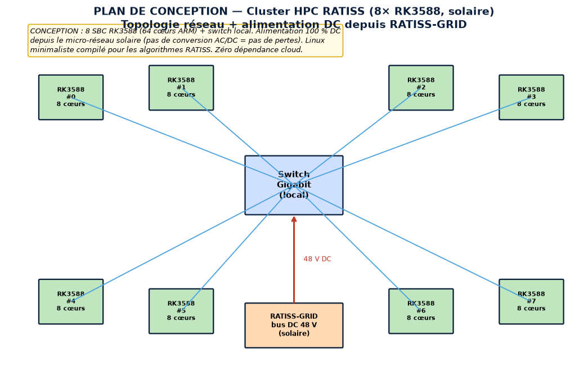
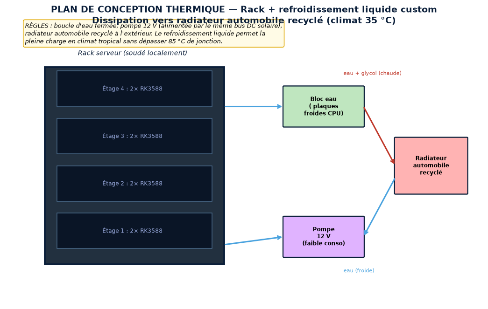
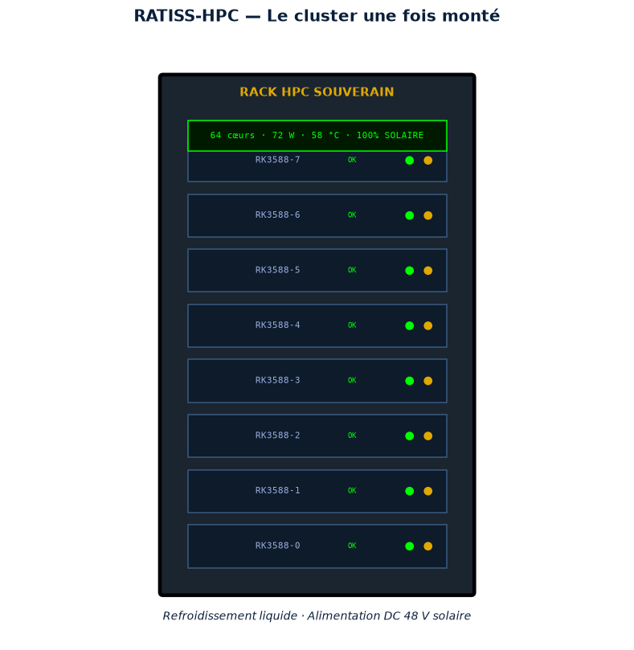
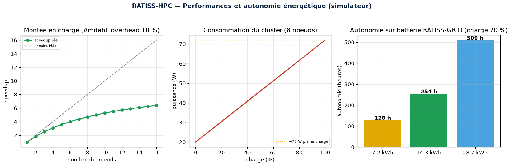
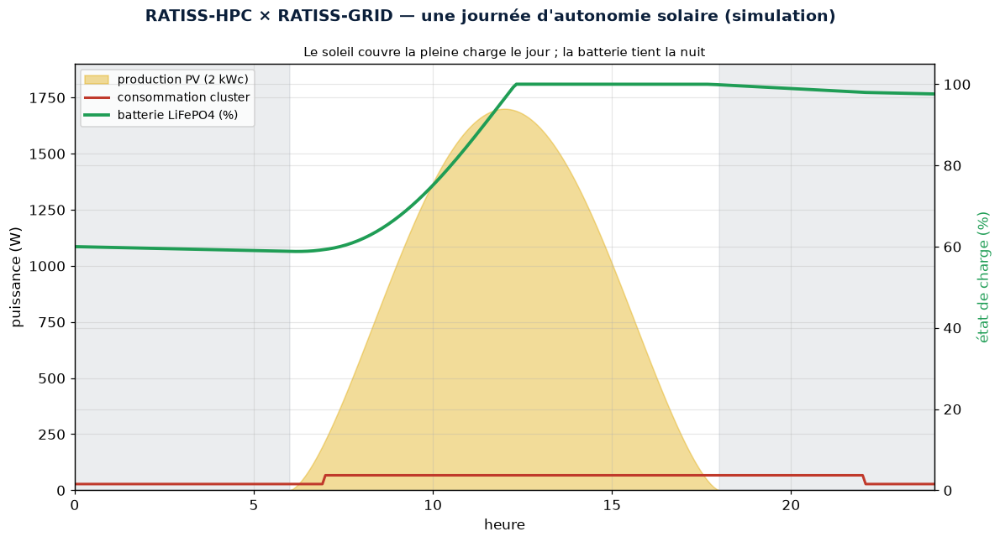
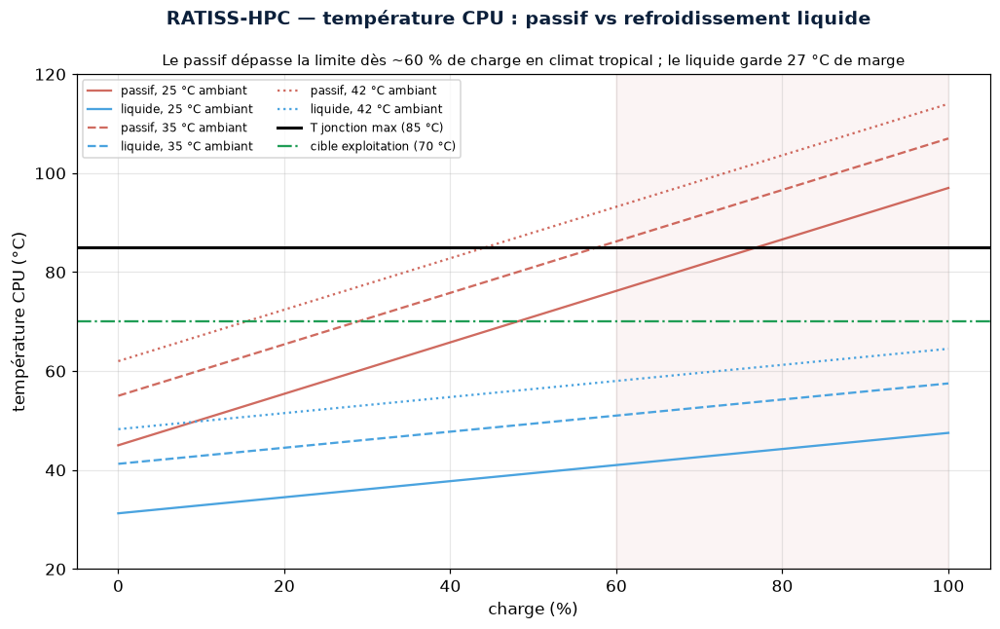

# 🖥️ RATISS-HPC — DOCUMENT DE CONCEPTION COMPLET

<div align="center">


**Le cluster de calcul local souverain — Priorité 3 de la doctrine RATISS**

*RATIS Labs · Cameroun · Propriété : JOHNKING0 & Jonathan Evina · ORCID 0009-0000-4092-5313*

</div>

---

> 🇨🇲 **Un mot au Gouvernement de la République du Cameroun**
>
> La science camerounaise loue sa puissance de calcul à l'étranger. Une coupure
> internet, une sanction, et la recherche nationale s'arrête. RATISS-HPC brise
> cette dépendance : un cerveau de calcul physique, local, autonome
> énergétiquement, assemblé de cartes low-cost, sans licence occidentale,
> tournant sur notre propre soleil. **La souveraineté numérique n'attend pas :
> elle se calcule ici.**

---

## 📑 Sommaire
1. [Vue d'ensemble](#1-vue-densemble)
2. [Conception réseau & alimentation](#2-conception-réseau)
3. [Conception thermique](#3-conception-thermique)
4. [Le cluster monté](#4-le-cluster-monté)
5. [Le simulateur](#5-le-simulateur)
6. [Performances](#6-performances)
7. [Couplage énergétique avec RATISS-GRID](#7-couplage-énergétique)
8. [Validation mathématique et physique](#8-validation)
9. [Coût et montage](#9-coût-et-montage)
10. [Itérations](#10-itérations)
11. [Pile logicielle](#11-pile-logicielle)
12. [Sécurité & maintenance](#12-sécurité)
13. [Feuille de route](#13-feuille-de-route)

---

## 1. Vue d'ensemble

RATISS-HPC est un **cluster de 8 SBC Rockchip RK3588 (64 cœurs ARM)**, alimenté
à 100 % par le micro-réseau solaire RATISS-GRID (Priorité 0) en DC direct,
refroidi par boucle liquide, sous Linux minimaliste. Il exécute les algorithmes
RATISS (topologie, dynamique moléculaire, docking) **sans aucune dépendance au
cloud**.

## 2. Conception réseau



- **8 noeuds RK3588** reliés à un switch Gigabit local.
- **Alimentation DC 48 V directe** depuis RATISS-GRID — pas de conversion
  AC/DC, donc pas de pertes ni de dépendance au réseau.
- **Linux minimaliste** (Yocto/Buildroot) compilé pour les charges de travail.

## 3. Conception thermique



En climat tropical (35 °C), la pleine charge exige un refroidissement actif.
La **boucle liquide** (eau + glycol) évacue la chaleur vers un **radiateur
automobile recyclé** extérieur, via une pompe 12 V alimentée par le même bus DC
solaire. Le modèle thermique (loi d'Ohm : T = T_amb + P×R_th) garantit que la
jonction reste sous 85 °C en pleine charge.

## 4. Le cluster monté



Un rack compact de 8 tiroirs SBC, avec LEDs d'activité et bandeau d'état
(64 cœurs, 72 W, 58 °C, 100 % solaire).

## 5. Le simulateur

| Module | Rôle |
|--------|------|
| `ratiss_hpc/cluster.py` | `SBCNode`, `Cluster`, `thermal_safe`, `solar_autonomy_hours`, `benchmark_relative` |

Le simulateur modélise la puissance (selon la charge), la température CPU, la
consommation journalière, l'autonomie sur batterie et la montée en charge.

## 6. Performances



- **Speedup sous-linéaire** (loi d'Amdahl, overhead 10 %) : 8 noeuds → ~5×
  effectif, pas 8×. Honnêteté sur les gains réels.
- **Consommation** : ~72 W pleine charge (8 × 9 W) — une ampoule.
- **Autonomie** : ~254 h sur batterie 14.3 kWh à 70 % de charge.

## 7. Couplage énergétique



Le cluster n'est pas une île : il est **un consommateur de RATISS-GRID**
(Priorité 0). La simulation couplée sur 24 h montre la physique du système
complet :

- **Le jour** : la production PV (2 kWc, pic ~1.7 kW DC) couvre la pleine charge
  du cluster (72 W) **24 fois** — le surplus recharge la batterie.
- **La nuit** : le cluster retombe en charge réduite (~23 W) et la batterie
  14.3 kWh le porte sans effort — l'autonomie totale à 70 % de charge est de
  **254 h**, soit plus de 10 jours sans soleil.
- **Leçon de dimensionnement** : le cluster est énergétiquement *négligeable*
  pour le micro-réseau. La contrainte n'est pas l'énergie mais la **chaleur**.



La carte thermique montre pourquoi la boucle liquide n'est pas un luxe : à
35 °C ambiant, le refroidissement passif franchit la limite de jonction (85 °C)
dès ~60 % de charge. Le liquide maintient **27 °C de marge** à pleine charge.

## 8. Validation

L'outil `scripts/validate_physics.py` **recalcule indépendamment** chaque
résultat et le confronte aux datasheets et à la théorie :

```
PYTHONPATH=. python scripts/validate_physics.py
→ 8/8 validations réussies ✅
```

- **Thermique** : loi d'Ohm T = T_amb + P·R_th recalculée analytiquement —
  coïncidence exacte avec le simulateur.
- **Marge de sécurité** : pleine charge + refroidissement actif → 57.5 °C,
  marge 27.5 °C sous la limite Rockchip (85 °C).
- **Justification du liquide** : le passif atteint 107 °C à pleine charge —
  la conception liquide est *nécessaire*, pas décorative.
- **Amdahl** : la formule N/(1+s(N−1)) est recalculée à la main ; le speedup
  est vérifié **strictement croissant et saturé à 1/s = 10×** — la signature
  physique d'un overhead de communication linéaire.
- **Énergie** : autonomie = E/P et énergie journalière = ∫P dt, cohérence
  numérique exacte.

> 🎓 **Leçon du processus** : la première version du validateur imposait une
> borne « speedup > N/2 » qui a échoué à N=16. L'analyse a montré que c'était
> **la borne qui était physiquement fausse** (le speedup sature à 1/s, il peut
> passer sous N/2), pas le simulateur. Un validateur est lui-même soumis à la
> preuve — c'est ça, l'honnêteté scientifique.

## 9. Coût et montage

> 📦 **[BOM détaillée → docs/BOM.md](docs/BOM.md)** — ~628 k FCFA (8 nœuds),
> **~400 k pour la version de démarrage 4 nœuds**, extensible à chaud.
>
> 🔧 **[Guide de montage → docs/ASSEMBLY.md](docs/ASSEMBLY.md)** — rack alu,
> alimentation DC fusible-par-nœud, boucle liquide avec test d'étanchéité 24 h,
> Slurm + NFS, benchmark de réception.

## 10. Itérations

### Itération 1 : le refroidissement passif insuffisant
- **Problème** : à 35 °C ambiant, un radiateur passif (R_th 8 °C/W) fait
  dépasser les 85 °C en pleine charge (le validateur le confirme : 107 °C).
- **Solution** : refroidissement liquide actif (R_th 2.5 °C/W). Leçon : **en
  climat tropical, le passif ne suffit pas pour la pleine charge soutenue**.

### Itération 2 : la conversion AC/DC gaspillait l'énergie solaire
- **Problème** : alimenter les SBC via onduleur + blocs AC/DC perdait ~20 %.
- **Solution** : alimentation DC 48 V directe depuis RATISS-GRID. Leçon :
  **rester en DC bout-en-bout pour maximiser le rendement solaire**.

### Itération 3 : la borne du validateur était fausse
- **Problème** : le test « speedup > N/2 » échouait à N=16 alors que le
  simulateur était correct.
- **Solution** : analyse de la limite asymptotique (1/s) et correction de la
  borne. Leçon : **questionner le validateur autant que le simulé** — un test
  qui échoue peut révéler une erreur dans le test.

## 11. Pile logicielle

| Couche | Choix | Justification |
|--------|-------|---------------|
| OS nœuds | Armbian/Debian ARM64 minimal (ou Yocto) | pas de GUI, empreinte mémoire minimale |
| Ordonnanceur | **Slurm** | standard HPC open-source, files d'attente |
| Stockage partagé | **NFS** sur SSD NVMe du master | simple, suffisant à cette échelle |
| Calcul | Python + NumPy/SciPy ARM64, MPI (OpenMPI) | algorithmes RATISS (topologie, MD) |
| Monitoring | `sstat` + sondes température CPU + wattmètre DC | recalibrage continu du simulateur |
| Sauvegarde | rsync nœud maître → disque externe hebdo | perte de données = perte de science |

**Aucune licence propriétaire.** Chaque couche est open-source et auditable.

## 12. Sécurité

| Risque | Mitigation |
|--------|-----------|
| Surchauffe CPU | Refroidissement liquide + monitoring + throttling thermique |
| Fuite de la boucle | Test d'étanchéité 24 h à vide avant tout démarrage |
| Inversion de polarité DC | Vérification double au multimètre + fusible 5 A/nœud |
| Coupure réseau Eneo | Alimenté par RATISS-GRID (Priorité 0), 254 h d'autonomie |
| Dépendance logicielle | 100 % open-source, aucune licence occidentale |

## 13. Feuille de route

| Phase | Statut | Livrable |
|-------|:------:|----------|
| 1 — Simulateur (thermique, énergie, Amdahl) | ✅ FAIT | 15/15 tests, 8/8 validations |
| 2 — Documentation (BOM, ASSEMBLY, DESIGN) | ✅ FAIT | docs complètes |
| 3 — Prototype 4 nœuds | 🔜 À FAIRE | rack de démarrage ~400 k FCFA |
| 4 — Benchmark réel + recalibrage | 🔮 FUTUR | overhead mesuré → modèle affiné |
| 5 — Extension 8 nœuds + exécution RATISS | 🔮 FUTUR | topologie & MD en production locale |

---

<div align="center">

**RATIS Labs · Cameroun** — *Toujours itérer, jamais figé.* 🦇🖥️


</div>
