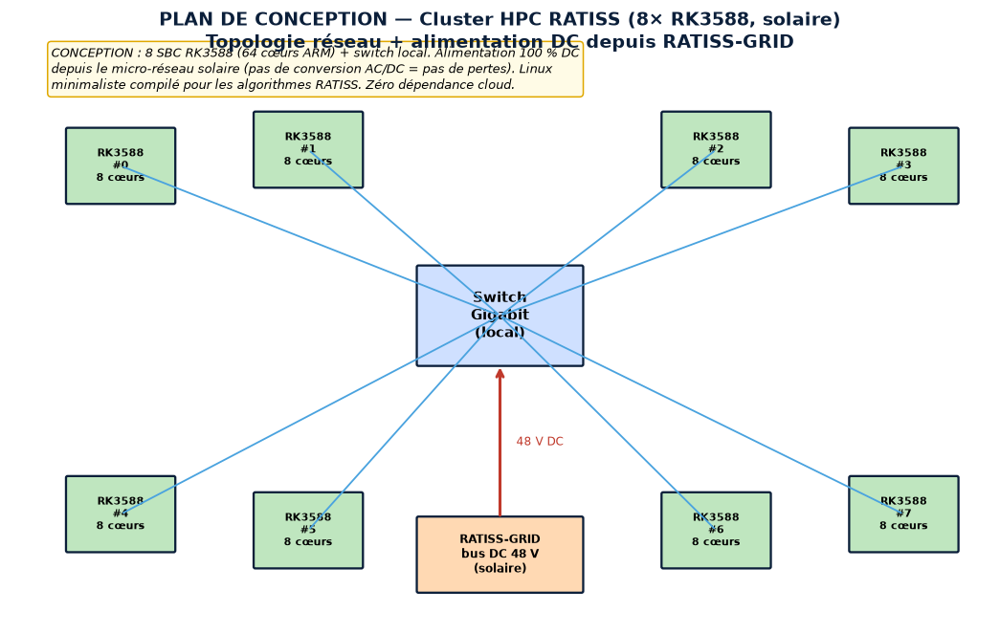
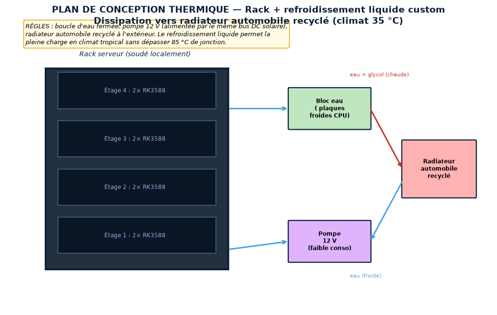
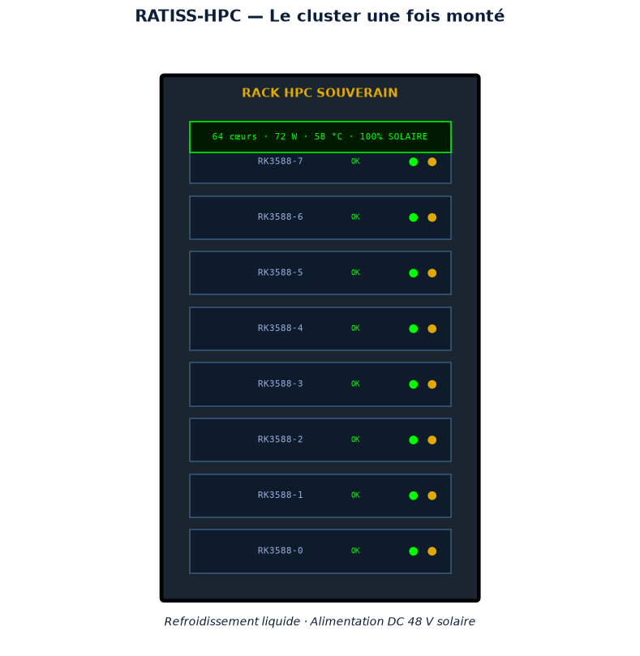
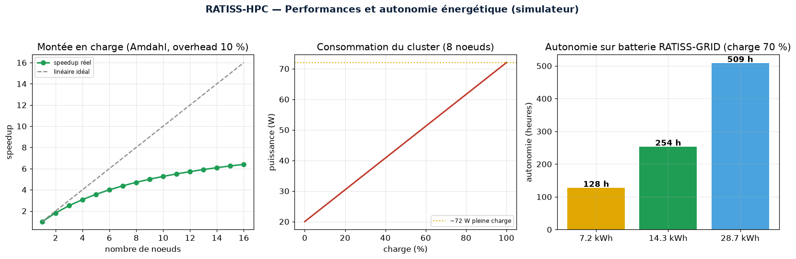
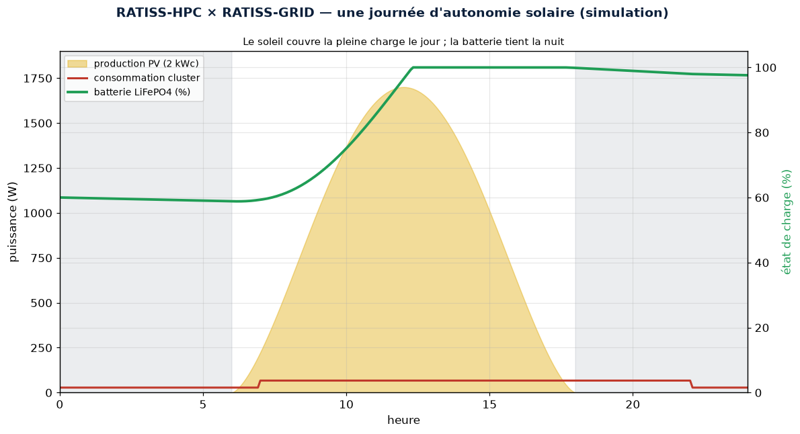
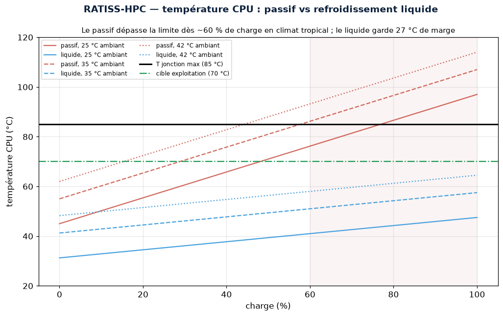

<p align="center">
  
</p>

[](https://github.com/jonathansearch)

<div align="center">


# 🖥️ RATISS-HPC — The Sovereign Local Compute Cluster

[](https://www.python.org/)
[](LICENSE)
[](CITATION.cff)
[](tests/)
[](https://orcid.org/0009-0000-4092-5313)

> Intellectual property: **JOHNKING0 & Jonathan Evina** · RATIS Labs (Cameroon)
> ORCID [0009-0000-4092-5313](https://orcid.org/0009-0000-4092-5313)

**[📘 Full design document → DESIGN.md](DESIGN.md)** ·
**[🔧 Assembly guide → docs/ASSEMBLY.md](docs/ASSEMBLY.md)** ·
**[📦 Bill of materials → docs/BOM.md](docs/BOM.md)** ·
**[🔬 References → docs/PHYSICS.md](docs/PHYSICS.md)** ·
**[🧮 Math/physics validation → scripts/validate_physics.py](scripts/validate_physics.py)**

</div>

> **Priority 3** of the technological sovereignty doctrine. A compute cluster of
> **64 ARM cores (8× RK3588)**, powered 100% by the RATISS-GRID solar
> micro-grid, liquid-cooled, administered under a minimalist Linux.
> **If the internet goes down or sanctions hit, the research continues.**

---

> 🇨🇲 **A word to the Government of the Republic of Cameroon**
>
> Cameroonian science rents its computing power abroad — Colab,
> IBM cloud, Western APIs. One internet outage, one sanction, one
> bill in foreign currency, and national research stops. RATISS-HPC breaks
> this dependency: a compute brain that is **physical, local and energy
> self-sufficient**, assembled from low-cost boards, with no Western software
> license, running on our own sunshine. This repository provides the blueprints
> and the simulator. **Digital sovereignty does not wait:
> it is computed here.**

---

## 🖼️ The project in images

### 🌐 Design blueprint — network architecture + DC power


### 🌡️ Thermal design blueprint — custom liquid cooling


### 🏭 The cluster once assembled (64 cores · 72 W · 100% solar)


### 📈 Performance and energy self-sufficiency


### ☀️ Coupling with RATISS-GRID — a day of solar autonomy


### 🌡️ Thermal map — why liquid cooling is not optional


---

## 🎯 Why this is a breakthrough

Depending on Colab, IBM Cloud or AlphaFold API means accepting that Cameroonian
research stops at the first internet outage or sanction. Classic HPC
servers cost millions, consume energy Eneo does not guarantee,
and are subject to Western software licenses.

**The RATISS answer**: low-power Single Board Computers (Rockchip RK3588,
RISC-V Kendryte K210) offering an unbeatable performance/watt ratio, powered
by direct DC from solar (Priority 0), with no AC/DC conversion, under a
minimalist Linux compiled for the RATISS algorithms (topology, MD, docking).

## 🔧 Specifications (Standard config)

| Specification | Value |
|-----------------|--------|
| Nodes | 8× Rockchip RK3588 |
| Total cores | **64 ARM cores** |
| Total RAM | 128 GB |
| Full-load power | ~72 W |
| Battery life on 14.3 kWh | **~254 h** |
| Cooling | liquid (recycled car radiator) |
| OS | minimalist Linux (Yocto/Buildroot) |

## 🚀 Quick start

```bash
pip install numpy matplotlib pytest
cd ratiss-hpc

# Simulate the cluster
PYTHONPATH=. python -c "
from ratiss_hpc.cluster import Cluster, thermal_safe, solar_autonomy_hours
c = Cluster.standard(8)
print(f'{c.total_cores()} cœurs, {c.power_w(1.0):.0f} W pleine charge')
print('thermique 100% charge:', thermal_safe(c, 1.0))
print(f'autonomie 14.3 kWh: {solar_autonomy_hours(c, 14.3):.0f} h')
"

# Figures
PYTHONPATH=. python scripts/generate_figures.py

# MATH & PHYSICS VALIDATION (independent recalculation: thermal, Amdahl, energy)
PYTHONPATH=. python scripts/validate_physics.py

# Tests
PYTHONPATH=. pytest tests/ -q
```

## 🧮 Mathematical & physics validation

`scripts/validate_physics.py` **independently** recalculates each result of the
simulator and confronts it with the datasheets (Rockchip RK3588) and theory
(Amdahl's law) — **8/8 validations**: thermal Ohm's law, full-load margin,
speedup saturation at 1/s, energy/autonomy consistency.

## 💰 Cost and setup

- **[📦 Detailed BOM](docs/BOM.md)**: ~628 k FCFA for 8 nodes, **~400 k for
  the 4-node starter version** (hot-extensible) — versus 3-10 M FCFA
  for an imported HPC server that consumes 10× more.
- **[🔧 Assembly guide](docs/ASSEMBLY.md)**: alu rack, direct 48 V DC power
  supply, liquid loop with 24 h leak test, Slurm + NFS, acceptance
  benchmark.

## ⚠️ Engineering transparency

This repository produces **simulation predictions** (power draw, thermal,
load scaling by Amdahl's law). Final validation requires the physical
cluster assembled and benchmarked. **Always iterating, never frozen.**

---

## 📄 License & citation

- **License**: [MIT](LICENSE) — © JOHNKING0 & Jonathan Evina, RATIS Labs (Cameroon).
- **Citation**: see [CITATION.cff](CITATION.cff) — ORCID
  [0009-0000-4092-5313](https://orcid.org/0009-0000-4092-5313).

---

*Cameroon sovereign hardware doctrine — Priority 3 of 5.*
